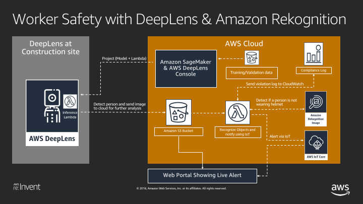

# Build worker safety system using DeepLens and Amazon Rekognition

## Learning Objectives of This lab
In this lab your will the following:
- Create and deploy object detection project to DeepLens.
- Modify the DeepLens object detection inference lambda function to detect persons and upload frame to S3.
- Create lambda function to identify persons who are not wearing safety hats.
- Analyze results using IoT and CloudWatch.

### Create S3 Buckets, IAM Role and Lambda Function

1. Click on button below to launch CloudFormation stack.

Region| Launch
------|-----
US East (N. Virginia) | 

2. Under Create stack, check the checkbox for "I acknowledge that AWS CloudFormation might create IAM resources with custom names" and click Create.

3. You should now see the screen with status CREATE_IN_PROGRESS. Click on the Stacks link in the top navigation and then click Refresh icon to see current CloudFormation stacks.

4. Click on the checkbox next to the stack to see additional details below and wait until CloudFormation stack has the status CREATE_COMPLETE.

5. Click on Resources tab and make note of the SrcBucket and its value under PhysicalID. This is the bucket where we will send frames from DeepLens to further analyze with Amazon Rekognition.

### Modify DeepLens Object Detection Inference Lambda Function

1. Go to https://console.aws.amazon.com/lambda/home?region=us-east-1#/functions/deeplens-object-detection?tab=graph

2. Copy the code from [greengrassHelloWorld.py](./code/greengrassHelloWorld.py) and paste under Function code for the lambda function.

3. Go to line 34 and modify line below with the name of your S3 bucket created in the earlier step by CloudFormation template.
  - bucket_name = "REPLACE-WITH-NAME-OF-YOUR-S3-BUCKET-CREATED-BY-CLOUDFORMATION"
4. Click Save.

5. Click on Actions, and then "Publish new version".

6. For Version description enter: Detect person and push frame to S3 bucket. and click Publish.

### Modify Lambda Function to Detect Persons Not Wearing Safety Hats

1. Download and store the [lambda code](./code/lambda.zip) on your local machine.
2. Go to AWS CloudFormation console at https://console.aws.amazon.com/cloudformation/home?region=us-east-1#/
3. Select the Worker-Safety CloudFormation stack and click on Resources Tab.
4. Click on the link for LambdaFunction under Physical ID column.
5. Under Function code:
  - For Code entry type, select: Upload a zip file
  - Click on Upload and upload the zip file you downloaded in step 1.
  - Click Save.

## Create Your Project

1. Using your browser, open the AWS DeepLens console at https://console.aws.amazon.com/deeplens/.
2. Choose Projects, then choose Create new project.
3. On the Choose project type screen
  - Choose Use a project template, then choose Object detection.
  - Scroll to the bottom of the screen, then choose Next.
4. On the Specify project details screen
   - In the Project information section:
      - Project name: Worker-Safety
      - Description: Detect persons not wearing safety hats.
  - Scroll to the bottom of the screen, then click Create.

This returns you to the Projects screen where the project you just created is listed with your other projects.

## Deploy Your Project

Next you will deploy the Object Detection project you just created.

1. From Deeplens console, On the Projects screen, choose the radio button to the left of your project name, then choose Deploy to device.

2. On the Target device screen, from the list of AWS DeepLens devices, choose the radio button to the left of the device where you want to deploy this project.

3. Choose Review.

   This will take you to the Review and deploy screen.

   If a project is already deployed to the device, you will see a warning message
   "There is an existing project on this device. Do you want to replace it?
   If you Deploy, AWS DeepLens will remove the current project before deploying the new project."

4. On the Review and deploy screen, review your project and click Deploy to deploy the project.

   This will take you to to device screen, which shows the progress of your project deployment.

## View Output of Your Project

1. Go to IoT and subscribe to topic worker-safety
2. To view message stream coming from DeepLens, go to IoT and subscribe to topic for your DeepLens device.

## View Worker-Safety Alerts in CloudWatch Dashboard

- Go to CloudWatch Console at https://console.aws.amazon.com/cloudwatch/home?region=us-east-1#
- Create a dashboard called “worker-safety-dashboard-your-name”
- Choose Line in the widget
- Under Custom Namespaces, select “string”, “Metrics with no dimensions”, and then select PersonsWithSafetyHat and PersonsWithoutSafetyHat.
- Next, set “Auto-refresh” to the smallest interval possible (1h), and change the “Period” to whatever works best for you (1 second or 5 seconds)

NOTE: These metrics will only appear once they have been sent to Cloudwatch via the Rekognition Lambda. It may take some time for them to appear after your model is deployed and running locally.

## Clean Up
Delete CloudFormatoin template and it will delete resources it created. Manually delete the S3 bucket as CloudFormation will not delete the bucket if it is not empty. Delete other resources created during the lab.
